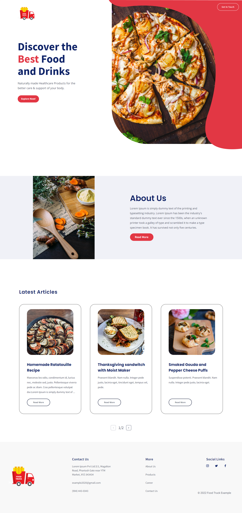
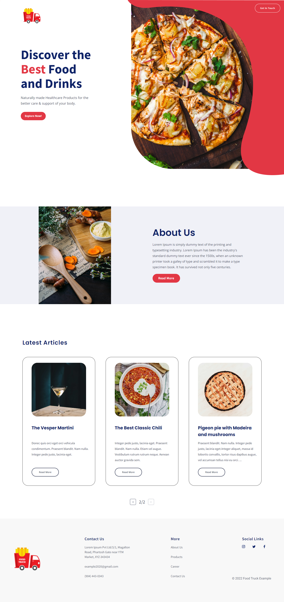
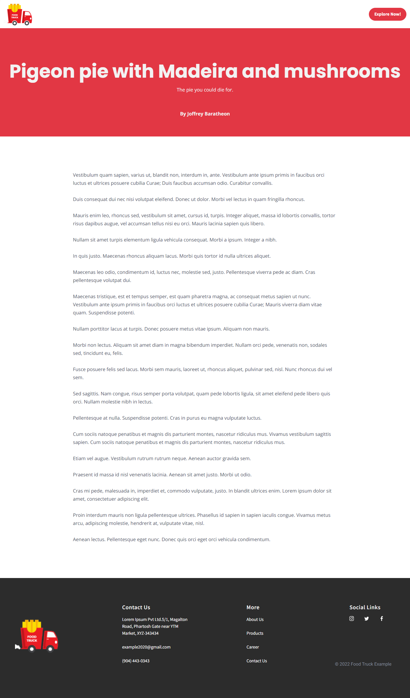
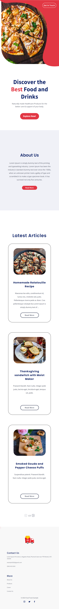
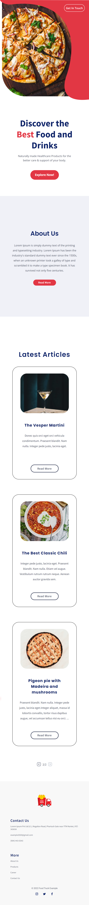
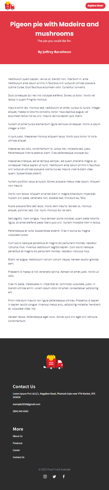

# Food Blogging Website - TIF React Assignment

> by Falguni Sarkar

This repository is for the submission of the assignment given by TIF for React Intern.

Screenshots of Desktop and Mobile Views:

- Desktop:

<table>
<tr>
<th>View 1</th>
<th>View 2</th>
<th>View 3</th>
</tr>
<tr>
<td>

</td>
<td>

</td>
<td>

</td>
</tr>
</table>

- Mobile:

<table>
<tr>
<th>View 1</th>
<th>View 2</th>
<th>View 3</th>
</tr>
<tr>
<td>

</td>
<td>

</td>
<td>

</td>
</tr>
</table>

> Deployed Link: <https://react-assignment-tif.vercel.app/>
